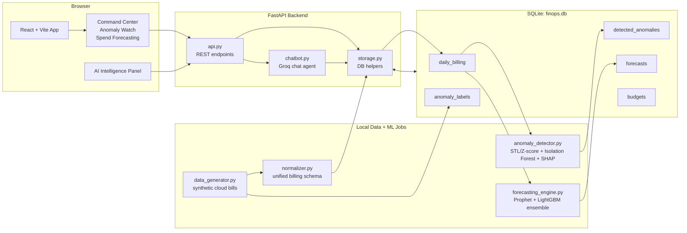
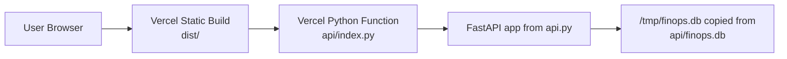

# FinOps Project Architecture

This project is a cloud cost intelligence platform named **CogniFinOps**. It combines a React dashboard, a FastAPI backend, SQLite analytics storage, local ML jobs, and an AI assistant for FinOps questions.

## System At A Glance



## Main Layers

| Layer | Files | Responsibility |
| --- | --- | --- |
| Frontend shell | `src/App.tsx`, `src/components/Layout/*` | Routes, sidebar, header, page layout, and always-visible AI panel. |
| Dashboard pages | `src/pages/*` | Visualize spend KPIs, anomaly root causes, forecasts, and budget status. |
| API client | `src/data/api.ts` | Central typed fetch wrapper for all frontend to backend calls. |
| Backend API | `api.py`, `api/index.py` | FastAPI app, endpoint orchestration, background job triggers, Vercel adapter. |
| Storage layer | `storage.py` | SQLite schema, connection handling, data loaders, query helpers, save helpers. |
| Data pipeline | `data_generator.py`, `normalizer.py` | Creates sample AWS/Azure/GCP billing exports and normalizes them into one daily cost model. |
| ML engines | `anomaly_detector.py`, `forecasting_engine.py` | Detects anomalies, calculates root-cause factors, and stores probabilistic forecasts. |
| AI assistant | `chatbot.py` | Builds live FinOps context from SQLite and answers user questions through Groq. |

## Important User Flows

### 1. Dashboard Loading

1. User opens the React app.
2. `Layout` renders the sidebar, header, active page, and AI panel.
3. Page components call `src/data/api.ts`.
4. FastAPI reads aggregated data from `finops.db` through `storage.py`.
5. The frontend renders KPI cards, charts, anomaly details, forecasts, and budget bars.

Key endpoints:

- `GET /api/summary` for Command Center KPIs, provider split, budget bars, and mini forecast.
- `GET /api/anomalies` for anomaly lists, filters, severity, SHAP factors, and drift.
- `GET /api/forecast` for historical spend plus p10/p50/p90 forecast bands.
- `GET /api/budgets` for team budget utilization and breach status.

### 2. Data Preparation Flow

1. `data_generator.py` creates raw cloud billing exports for AWS, Azure, and GCP.
2. `normalizer.py` maps provider-specific fields into a shared schema:
   `date`, `provider`, `service`, `category`, `team`, `environment`, `region`, `cost_usd`.
3. `storage.py` initializes SQLite and loads:
   `daily_billing`, `anomaly_labels`, and default `budgets`.
4. Processed CSV files are kept under `data/processed/`; the serving database lives at `data/database/finops.db`.

Run locally with:

```bash
python storage.py
```

### 3. Anomaly Detection Flow

1. User clicks **Re-run Detection** in Command Center.
2. Frontend calls `POST /api/run-detection`.
3. `api.py` starts a FastAPI background task.
4. `anomaly_detector.py` loads cost time series from `daily_billing`.
5. The detector combines:
   - STL or rolling Z-score baselines
   - Isolation Forest outlier detection
   - severity scoring by deviation percentage
   - SHAP factor attribution when available
6. Results are saved to `detected_anomalies`.
7. Frontend polls `GET /api/detection-status` and refreshes the dashboard when complete.

On Vercel, live detection is disabled and the app uses bundled demo results.

### 4. Forecasting Flow

1. User opens Spend Forecasting or clicks **Re-run Forecasting**.
2. Frontend calls `GET /api/forecast` for existing forecasts or `POST /api/run-forecast` to regenerate locally.
3. `forecasting_engine.py` builds daily series for total spend, provider, team, and service dimensions.
4. Forecast models generate 7, 30, and 90 day p10/p50/p90 bands:
   - Prophet for time-series seasonality
   - LightGBM quantile regression for feature-based prediction
   - ensemble blend when both are available
5. Forecast rows are stored in `forecasts` and displayed as actual vs predicted charts.

On Vercel, live forecasting is disabled and the app uses bundled demo forecasts.

### 5. AI Assistant Flow

1. User asks a question in the AI panel.
2. Frontend calls `POST /api/chat` with the current message and chat history.
3. `chatbot.py` queries SQLite for a compact live snapshot:
   spend totals, provider/team/service breakdowns, recent daily spend, anomalies, budgets, and forecasts.
4. The snapshot is placed in the system prompt.
5. Groq returns a FinOps-focused answer with concrete numbers from the database.

Required environment variable:

```bash
GROQ_API_KEY=...
```

Optional:

```bash
GROQ_MODEL=llama-3.3-70b-versatile
```

## Database Model

| Table | Purpose |
| --- | --- |
| `daily_billing` | Canonical daily cloud spend facts by provider, service, team, environment, and region. |
| `anomaly_labels` | Ground-truth labels from generated data for validation and traceability. |
| `detected_anomalies` | Saved anomaly results with severity, expected cost, deviation, detector, description, and SHAP JSON. |
| `forecasts` | Probabilistic forecasts by horizon, date, model, and optional provider/team/service filters. |
| `budgets` | Monthly or quarterly team budget configuration. |

## Deployment Shape



Local development uses the full Python stack and `data/database/finops.db`. Vercel uses `api/index.py` as a thin adapter around the same FastAPI app and ships a bundled SQLite database at `api/finops.db`.

## How To Think About The Architecture

The project has two modes:

- **Analytics build mode:** generate, normalize, detect anomalies, forecast, and write results into SQLite.
- **Serving mode:** read from SQLite through FastAPI and render a polished FinOps dashboard in React.

That separation keeps the UI fast and simple: expensive ML work is precomputed or triggered in the background, while dashboard pages only consume clean API responses.
