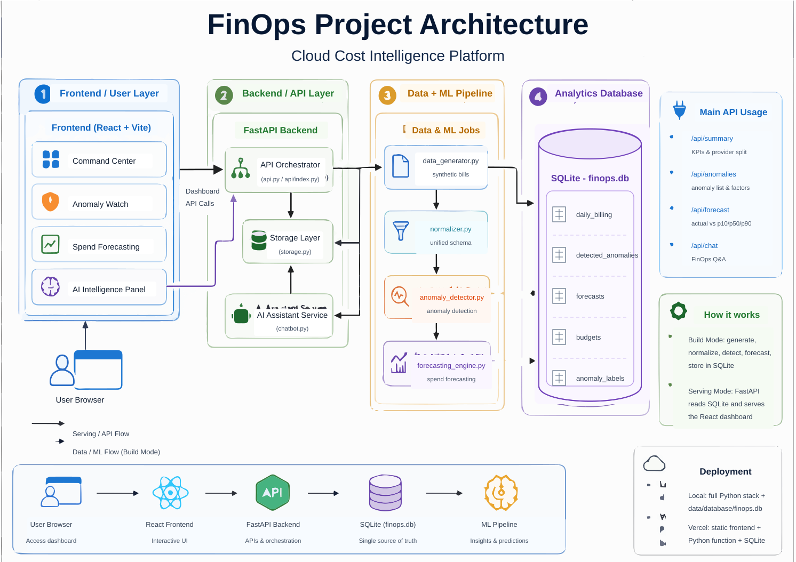

# FinOps

FinOps is a cloud cost intelligence platform. It helps teams understand cloud spending, spot unusual cost spikes, forecast future spend, track budgets, and ask AI questions about the data in simple language.

Live project: [https://finops-arman0604-arman0604s-projects.vercel.app/](https://finops-arman0604-arman0604s-projects.vercel.app/)

## What This Project Does

This project turns AWS, Azure, and GCP billing data into an interactive dashboard. The backend stores clean cost data in SQLite, runs anomaly detection and forecasting jobs, and serves the results through API endpoints. The frontend shows those results in a simple dashboard for finance, engineering, and cloud teams.

In short: it helps answer questions like:

- How much have we spent this month?
- Which cloud provider or team is spending the most?
- Are there any unusual cost spikes?
- Which teams are close to budget limits?
- What might our spend look like in the next 7, 30, or 90 days?
- What does the AI assistant say about current cloud cost issues?

## Top Features

- **Command Center:** Shows total monthly spend, savings opportunities, active anomalies, provider split, budget progress, and forecast summary.
- **Anomaly Watch:** Lists unusual cost spikes with severity, affected provider, service, team, expected cost, actual cost, and likely root-cause factors.
- **Spend Forecasting:** Shows future cloud spend using 7-day, 30-day, and 90-day forecast views with p10, p50, and p90 prediction ranges.
- **Budget Tracking:** Compares team budgets with actual month-to-date spend and highlights warning or breach risks.
- **AI Intelligence Panel:** Lets users ask FinOps questions like cost spikes, overspending teams, forecasts, and what-if scenarios.
- **Multi-Cloud Billing Data:** Works with sample AWS, Azure, and GCP billing data normalized into one common format.
- **Local Data And ML Pipeline:** Includes scripts to generate sample billing data, normalize it, detect anomalies, create forecasts, and save everything into SQLite.
- **Vercel Deployment Ready:** The deployed version serves the React app with a Python FastAPI serverless function and bundled SQLite database.

## Tech Stack

| Technology | Role In This Project |
| --- | --- |
| **React** | Builds the user interface for dashboard pages, charts, filters, and AI panel. |
| **TypeScript** | Adds safer frontend code by defining API response types and component data shapes. |
| **Vite** | Runs the frontend locally and creates the production build. |
| **React Router** | Handles pages like Command Center, Anomaly Watch, Spend Forecasting, and Login. |
| **Recharts** | Displays spend charts, provider split, budget bars, and forecast graphs. |
| **Lucide React** | Provides clean dashboard icons. |
| **FastAPI** | Serves backend APIs such as summary, anomalies, forecasts, budgets, and chat. |
| **SQLite** | Stores billing data, anomaly results, forecasts, budgets, and labels in `finops.db`. |
| **Pandas And NumPy** | Prepare, clean, aggregate, and query cost data. |
| **Scikit-learn And Statsmodels** | Power anomaly detection with statistical baselines and machine learning. |
| **Prophet And LightGBM** | Power the local spend forecasting pipeline. |
| **Groq API** | Powers the AI assistant responses using live FinOps context from the database. |
| **Vercel** | Hosts the deployed frontend and Python API function. |

## Architecture



## How To Run On Localhost

### 1. Install Node.js dependencies

```bash
npm install
```

### 2. Create and activate a Python environment

```bash
python -m venv .venv
```

On Windows PowerShell:

```powershell
.\.venv\Scripts\Activate.ps1
```

On macOS or Linux:

```bash
source .venv/bin/activate
```

### 3. Install Python dependencies

For the API and AI assistant:

```bash
pip install -r requirements.txt
```

For the full local data, anomaly detection, and forecasting pipeline:

```bash
pip install -r requirements-full.txt
```

### 4. Set environment variables

Create a `.env` file from the example file:

```bash
cp .env.example .env
```

On Windows PowerShell:

```powershell
Copy-Item .env.example .env
```

Then add your Groq key in `.env` if you want to use the AI assistant:

```env
GROQ_API_KEY=your_groq_api_key_here
```

### 5. Prepare the local database

The project already includes database files, but you can rebuild the local sample database with:

```bash
python storage.py
```

This generates sample billing data, normalizes it, and loads it into SQLite.

### 6. Start the backend API

```bash
python api.py
```

The API will run at:

```text
http://localhost:8000
```

API docs are available at:

```text
http://localhost:8000/docs
```

### 7. Start the frontend

Open a second terminal and run:

```bash
npm run dev
```

The frontend will run at:

```text
http://localhost:5173
```

Now open `http://localhost:5173` in your browser.

## Useful Commands

```bash
npm run build
```

Builds the frontend for production.

```bash
npm run lint
```

Runs frontend lint checks.

```bash
python anomaly_detector.py
```

Runs anomaly detection locally.

```bash
python forecasting_engine.py
```

Runs spend forecasting locally.
